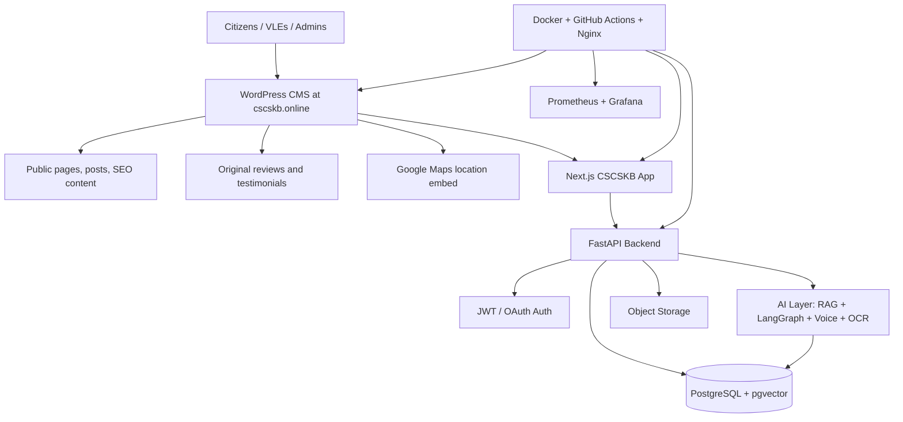

# CSCSKB Online WordPress Integration Plan

## Target WordPress Site

- Production domain: `https://cscskb.online`
- Integration goal: merge the CSCSKB Online AI-powered knowledge and service platform blueprint with the existing WordPress website so WordPress can remain the public CMS while the Next.js/FastAPI platform powers application-grade CSC services, AI search, dashboards, authentication, reviews, and location features.

## Recommended Architecture



## WordPress Merge Strategy

### Option A: WordPress as the Front Door

Use WordPress for public content and route application features into subpaths or subdomains:

- `https://cscskb.online/` — WordPress home, pages, blog, SEO landing pages.
- `https://cscskb.online/services/` — WordPress service directory pages with call-to-action links into the app.
- `https://cscskb.online/app/` — reverse-proxied Next.js web application.
- `https://cscskb.online/api/` — reverse-proxied FastAPI backend.
- `https://cscskb.online/admin/` — WordPress admin remains protected and separate from the CSCSKB platform admin dashboard.

### Option B: Headless WordPress

Use WordPress only as a content backend and render all public pages in Next.js:

- WordPress REST API provides posts, pages, reviews, FAQs, schemes, notices, and media.
- Next.js renders the complete public site and app with one design system.
- FastAPI powers authentication, AI, service workflows, analytics, and admin APIs.

For the current project, Option A is the safest migration path because it preserves the existing WordPress site while allowing the new platform to launch incrementally.

## WordPress Content to Add

### Homepage Sections

1. Hero section: `CSCSKB Online – AI Powered CSC Knowledge & Service Platform`.
2. CSC services directory with eligibility, documents, fees, and processing time.
3. AI assistant call-to-action for citizens and VLEs.
4. Reviews and testimonials block.
5. Google Map location block.
6. Contact block for Ankit Tiwari CSC Center.

### Suggested WordPress Pages

- `/about/`
- `/services/`
- `/schemes/`
- `/knowledge-base/`
- `/ai-assistant/`
- `/reviews/`
- `/contact/`
- `/privacy-policy/`
- `/terms-and-conditions/`

### Original Review Content

The following original reviews can be added to WordPress as testimonials or review cards:

> "Very helpful CSC center for online government services. The guidance was clear, the process was transparent, and my work was completed on time."

> "Ankit Tiwari CSC Center provides quick support for digital services, forms, certificates, and online applications. Staff behavior is professional and friendly."

> "A reliable place for CSC-related work. I liked the step-by-step explanation, document checklist support, and fast service updates."

> "Good experience with online service assistance. The center explains eligibility, required documents, fees, and expected processing time before starting the work."

## Map Location Integration

The confirmed Google Maps share URL is:

```text
https://maps.app.goo.gl/WNidZh1cEukiXna88
```

Add this URL to the WordPress contact page as the primary directions link. If a full Google Maps place embed URL is available from the business profile, replace the search-based iframe source below with that official embed URL.

### WordPress Map Embed Block

```html
<section class="cscskb-location">
  <h2>Visit Ankit Tiwari CSC Center</h2>
  <p>Use the map link below for directions to the CSC center.</p>
  <p><a href="https://maps.app.goo.gl/WNidZh1cEukiXna88" target="_blank" rel="noopener noreferrer">Open location in Google Maps</a></p>
  <!-- Replace src with the official Google Maps embed URL from the business profile. -->
  <iframe
    title="Ankit Tiwari CSC Center location map"
    src="https://www.google.com/maps?q=Ankit%20Tiwari%20CSC%20Center&output=embed"
    width="100%"
    height="420"
    style="border:0; border-radius:16px;"
    allowfullscreen=""
    loading="lazy"
    referrerpolicy="no-referrer-when-downgrade">
  </iframe>
</section>
```

## Nginx Reverse Proxy Example

```nginx
server {
    server_name cscskb.online www.cscskb.online;

    location / {
        proxy_pass http://wordpress:80;
        proxy_set_header Host $host;
        proxy_set_header X-Real-IP $remote_addr;
        proxy_set_header X-Forwarded-For $proxy_add_x_forwarded_for;
        proxy_set_header X-Forwarded-Proto $scheme;
    }

    location /app/ {
        proxy_pass http://nextjs:3000/;
        proxy_set_header Host $host;
        proxy_set_header X-Real-IP $remote_addr;
        proxy_set_header X-Forwarded-For $proxy_add_x_forwarded_for;
        proxy_set_header X-Forwarded-Proto $scheme;
    }

    location /api/ {
        proxy_pass http://fastapi:8000/;
        proxy_set_header Host $host;
        proxy_set_header X-Real-IP $remote_addr;
        proxy_set_header X-Forwarded-For $proxy_add_x_forwarded_for;
        proxy_set_header X-Forwarded-Proto $scheme;
    }
}
```

## Implementation Checklist

- [ ] Back up the current WordPress database and uploads directory.
- [ ] Add the review/testimonial block to WordPress.
- [ ] Add the map section to the WordPress contact page.
- [ ] Configure `/app/` to proxy to the Next.js frontend.
- [ ] Configure `/api/` to proxy to the FastAPI backend.
- [ ] Confirm WordPress permalinks do not conflict with app/API paths.
- [ ] Add canonical URLs and metadata for SEO pages.
- [ ] Test mobile responsiveness, Core Web Vitals, and form submissions.
- [ ] Verify Google Maps link opens correctly on desktop and mobile.

## Auto-Updating CSC News Marquee

Install the bundled WordPress plugin at `wordpress-plugin/cscskb-csc-news-marquee/cscskb-csc-news-marquee.php` and add this shortcode to the WordPress homepage or header:

```text
[cscskb_csc_news_marquee]
```

The marquee checks official CSC-owned sources first, caches headlines for 30 minutes, links users to the source page, and falls back to local CSCSKB announcements if official sources are temporarily unavailable.
